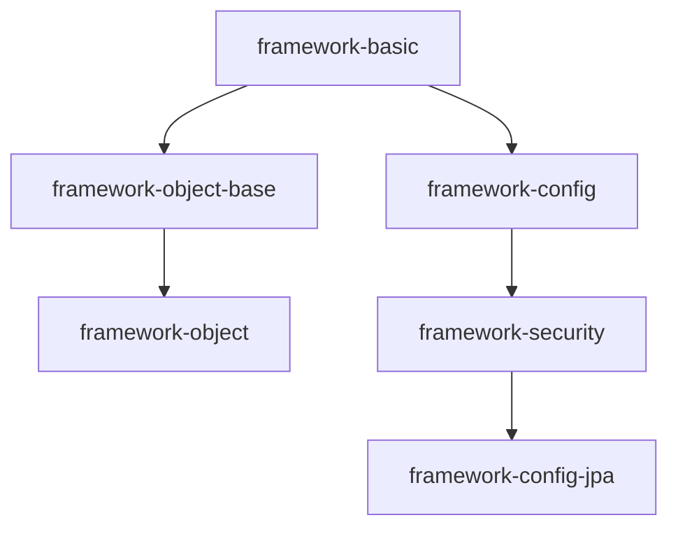
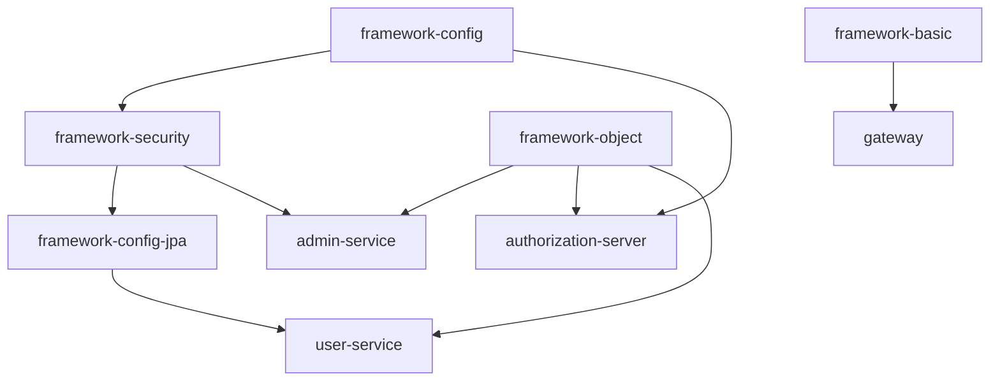

基于Spring Cloud Alibaba的后端系统
==========

### 技术栈

- [Spring Boot](https://spring.io/projects/spring-boot)
    - [WebSockets](https://docs.spring.io/spring-framework/docs/5.3.18/reference/html/web.html#websocket)
    - [Spring Data JPA](https://spring.io/projects/spring-data-jpa)
    - [Spring Data Redis](https://spring.io/projects/spring-data-redis)
- [Spring Cloud](https://spring.io/projects/spring-cloud)
    - [Spring Cloud Gateway](https://spring.io/projects/spring-cloud-gateway)
    - [Spring Cloud OpenFeign](https://spring.io/projects/spring-cloud-openfeign)
- [Spring Cloud Alibaba](https://github.com/alibaba/spring-cloud-alibaba)
    - [Nacos](https://nacos.io/zh-cn/docs/what-is-nacos.html)
    - [Seata](https://seata.io/zh-cn/docs/overview/what-is-seata.html)
- [Spring Authorization Server](https://github.com/spring-projects/spring-authorization-server)
- [XXL-JOB](https://github.com/xuxueli/xxl-job)
- [Apache RocketMQ](https://github.com/apache/rocketmq)
- [Flowable](https://github.com/flowable/flowable-engine)

### 需要以docker启动的基础服务

- 目录：
  > /docker

### 数据库

- 目录:
  > /db

### Docker 构建

```shell
docker-compose build
```

### 模块关系

#### framework



#### driftwood-cloud

