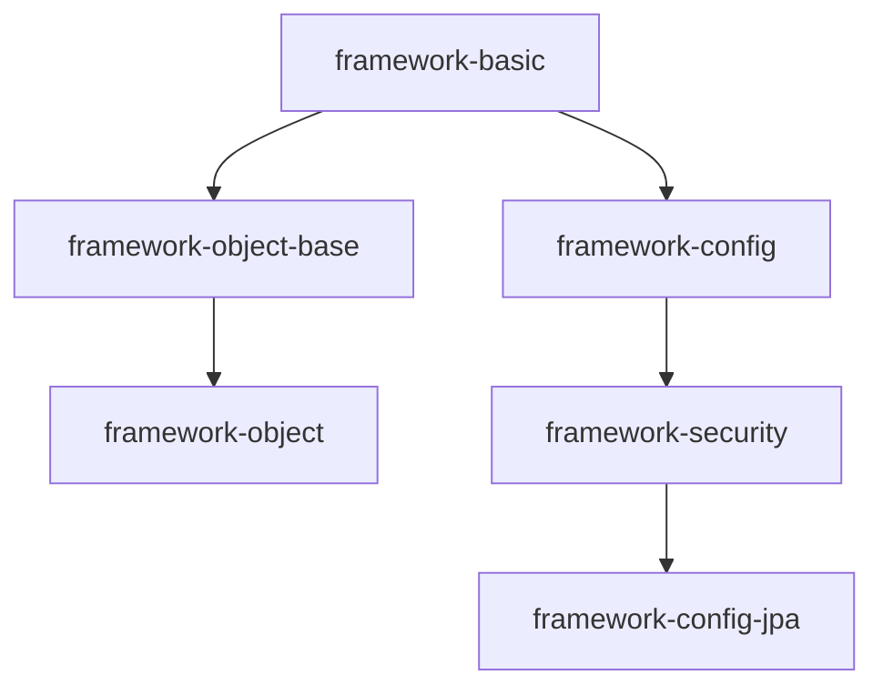
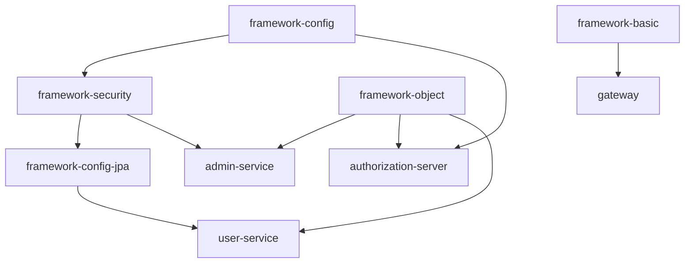

基于Spring Cloud Alibaba的后端系统
==========

### 技术栈

- [Spring Boot](https://spring.io/projects/spring-boot)
    - [WebSockets](https://docs.spring.io/spring-framework/docs/5.3.18/reference/html/web.html#websocket)
    - [Spring Data JPA](https://spring.io/projects/spring-data-jpa)
    - [Spring Data Redis](https://spring.io/projects/spring-data-redis)
- [Spring Cloud](https://spring.io/projects/spring-cloud)
    - [Spring Cloud Gateway](https://spring.io/projects/spring-cloud-gateway)
    - [Spring Cloud OpenFeign](https://spring.io/projects/spring-cloud-openfeign)
- [Spring Cloud Alibaba](https://github.com/alibaba/spring-cloud-alibaba)
    - [Nacos](https://nacos.io/zh-cn/docs/what-is-nacos.html)
    - [Seata](https://seata.io/zh-cn/docs/overview/what-is-seata.html)
- [Spring Authorization Server](https://github.com/spring-projects/spring-authorization-server)
- [XXL-JOB](https://github.com/xuxueli/xxl-job)
- [Apache RocketMQ](https://github.com/apache/rocketmq)
- [Flowable](https://github.com/flowable/flowable-engine)

### 需要以docker启动的基础服务

- 目录：
  > /docker

### 数据库

- 目录:
  > /db

### Docker 构建

```shell
docker-compose build
```

### 模块关系

#### framework



#### driftwood-cloud



### 运行参数

> 主要用来配置阿里系框架的日志生成位置和是否启用sentinel控制台配置

#### gateway

- 添加 VM 选项

> -Xms64m -Xmx256m -Dcsp.sentinel.app.type=1 -Dcsp.sentinel.log.dir=logs/gateway/sentinel -DJM.LOG.PATH=logs/gateway
> -DJM.SNAPSHOT.PATH=logs/gateway

- 程序实参

> --spring.cloud.sentinel.transport.dashboard=""

#### authorization-server

- 添加 VM 选项

> -Xms64m -Xmx256m -Dcsp.sentinel.log.dir=logs/authorization-server/sentinel -DJM.LOG.PATH=logs/authorization-server
> -DJM.SNAPSHOT.PATH=logs/authorization-server

- 程序实参

> --spring.cloud.sentinel.transport.dashboard=""

#### admin-service

- 添加 VM 选项

> -Xms64m -Xmx256m -Dcsp.sentinel.log.dir=logs/admin-service/sentinel -DJM.LOG.PATH=logs/admin-service
> -DJM.SNAPSHOT.PATH=logs/admin-service

- 程序实参

> --spring.cloud.sentinel.transport.dashboard=""

#### user-service

- 添加 VM 选项

> -Xms64m -Xmx256m -Dcsp.sentinel.log.dir=logs/user-service/sentinel -DJM.LOG.PATH=logs/user-service
> -DJM.SNAPSHOT.PATH=logs/user-service

- 程序实参

> --spring.cloud.sentinel.transport.dashboard=""

### 服务端口分配

> 其他未列举出来的服务可能属于测试服务

| 服务                          | 端口   | 
|-----------------------------|------|
| gateway                     | 8900 |
| authorization-server        | 8901 |
| admin-service               | 8902 |
| user-service                | 8903 |
| framework-service-websocket | 8910 |
| framework-service-job       | 8911 |
| framework-service-minio     | 8912 |
| framework-service-flowable  | 8913 |
